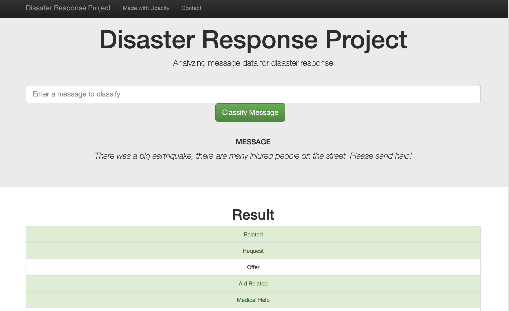
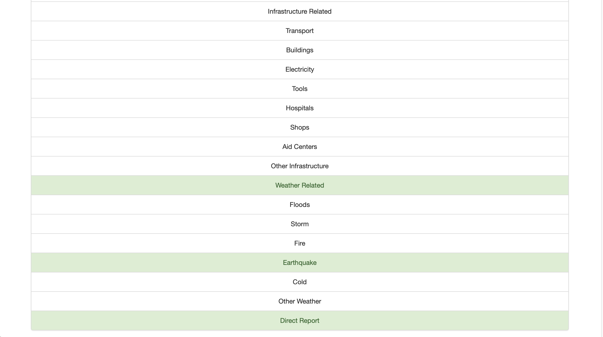
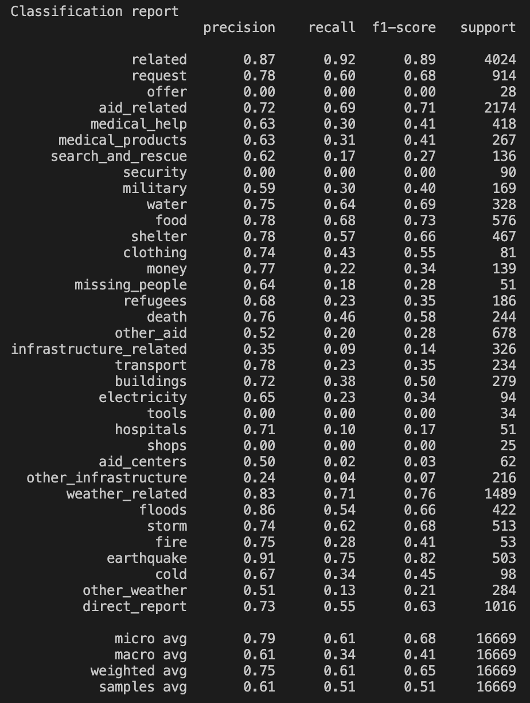
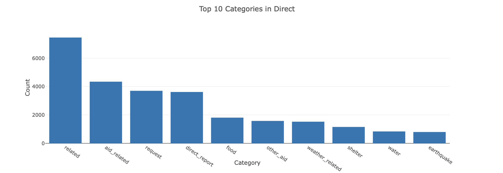
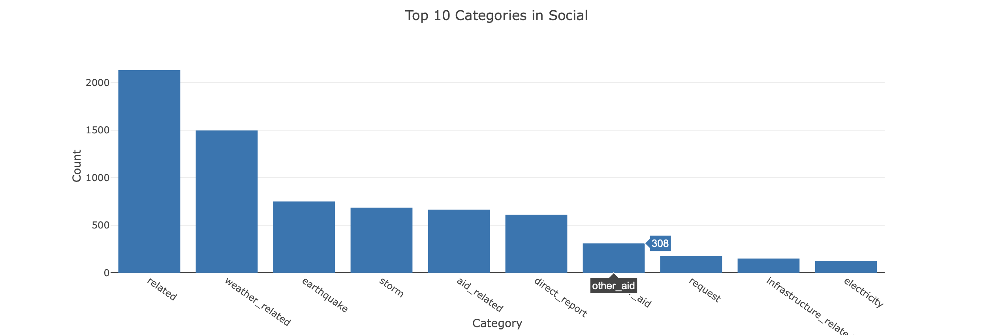
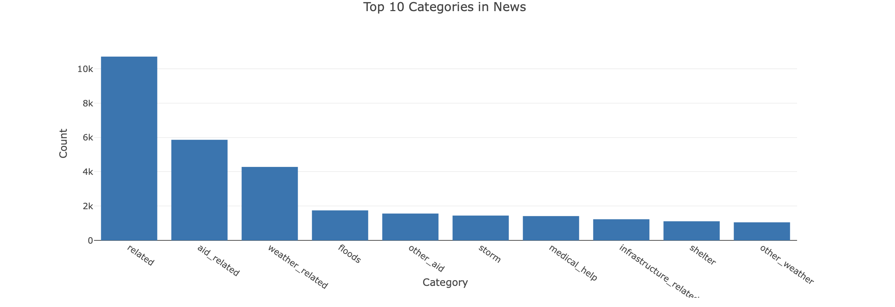

# Disaster-Response-Pipeline-Udacity

# Description
This project provides a webinterface for analyze disaster data from Figure Eight. A model for an API that classifies disaster messages has been build.
A data set contains real messages that were sent during disaster events. Therefore a machine learning pipeline have been created to categorize these events so that you can send the messages to an appropriate disaster relief agency.

# Goal
The project include a web app where an emergency worker can input a new message and get classification results in several categories. The web app also displays visualizations of the data.

# Installation
 - Python3
 - Machine Learning Libraries: `NumPy`, `Pandas`, `Scikit-Learn`
-  Natural Language Process Libraries: `nltk`
-  SQLlite Database Libraries: `SQLalchemy`
-  Model Loading and Saving Library: `Pickle`
-  Web App and Data Visualization: `Flask`, `Plotly`

### Instructions for execution:
1. Run the following commands in the **project's root directory** to set up your database and model.

    - To run **ETL pipeline** that cleans data and stores in database
        `python data/process_data.py data/disaster_messages.csv data/disaster_categories.csv data/disaster_response.db`
    - To run **ML pipeline** that trains classifier and saves
        `python models/train_classifier.py data/disaster_response.db models/classifier.pkl`

2. Run the following command in the **app's directory** to run your **web app**.
    `python run.py`

3. Go to http://0.0.0.0:3001/ to see the web app.

# File Description

The **notebooks folder** contains two jupyter notebooks that help you understand how the pipeline scripts are built step by step:

- **ETL Pipeline Preparation**: Loads the datasets, merges them, cleans the data and stores them in a SQLite database.
- **ML Pipeline Preparation**: Loads the dataset from SQLite database, splits data into train and test set, builds a text preprocessing and ML pipeline, trains and tunes models using GridSearch (SVM, Random Forest), outputs reults on the test set and exports the final model as a pickle file.

**Python scripts**:

- `data/process_data.py` - ETL pipeline 
- `models/train_classifier.py` - ML Pipeline
- `app/run.py` - Flask Web App

**Datasets**:

- **messages.csv**: Contains the id, message and genre, i.e. the method (direct, social, ...) the message was sent.
- **categories.csv**: Contains the id and the categories (related, offer, medical assistance..) the message belonges to.

# Results

The final output of the project is an **interactive web app** that takes a **message from the user** as an input and then **classifies it** into the respective categories.

**Classification Report running a Linear Support Vector Machines Classifier**.

**Distribution of Top 10 Categories by Genre**

# Note 

The dataset has highly **imbalanced classes**, i.e. there is an uniqual representation of classes. This affects the ML algorithms because the probability that the instances belong to the majority class is significantly high, so the algorithms are more likely to classify new observations to the majority class.

# Licensing, Authors, Acknowledgments
This project has been completed as part of the **Data Science Nanodegree** on [Udacity](https://www.udacity.com).
The data was collected by [Figure Eight](https://appen.com) and provided by [Udacity](https://www.udacity.com).

